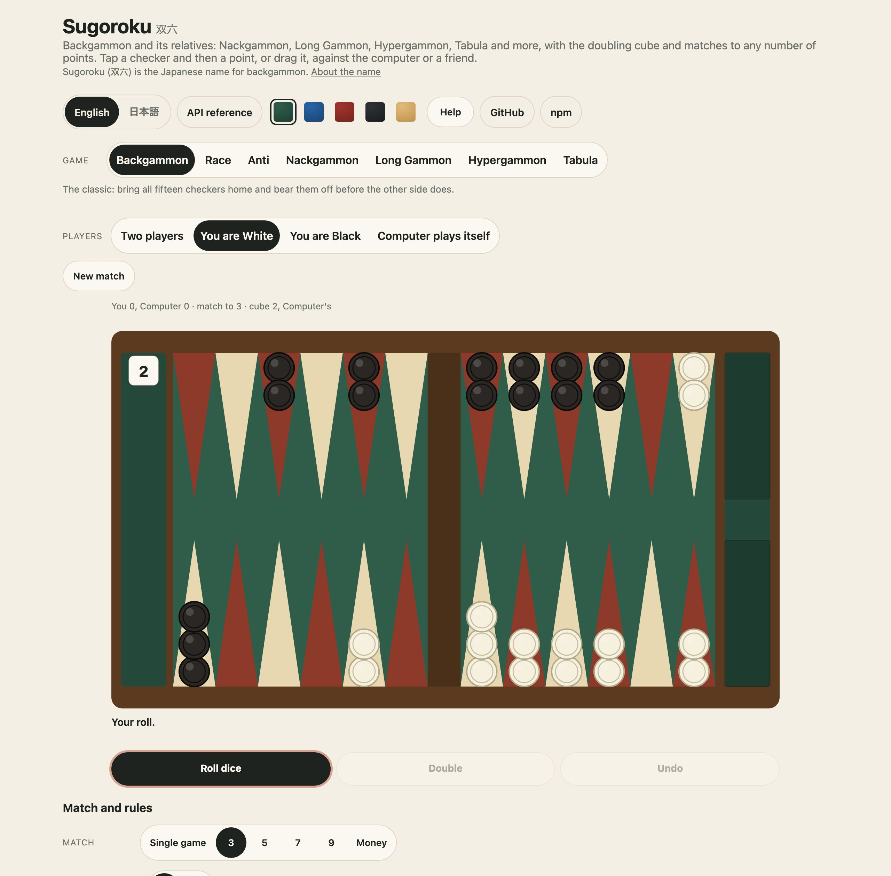
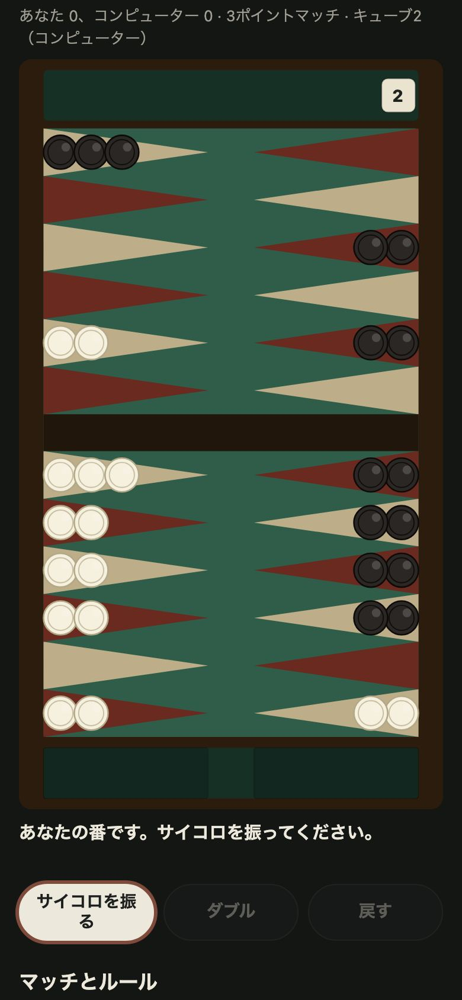

<h1 align="center">Sugoroku <sub>双六</sub></h1>

<p align="center"><strong>Backgammon and its variants for JavaScript and TypeScript.</strong><br>
The full rules, the doubling cube and match play with the Crawford rule, Nackgammon, Long Gammon, Hypergammon, Tabula, Anti-Backgammon and a race that starts from the bar, games written as text that a server can replay move by move, a seeded dice sequence, standard move notation, position IDs, a computer player in four strengths, and the board drawn as SVG and played by touch and mouse in any page with one call or one tag. No dependencies.</p>

<p align="center">
  <a href="https://github.com/johnmorrisdotca/sugoroku/actions/workflows/ci.yml"></a>
  <a href="https://www.npmjs.com/package/@johnmorrisdotca/sugoroku"></a>
  <a href="./LICENSE"></a>
  
</p>

<p align="center"><a href="https://johnmorrisdotca.github.io/sugoroku/"><strong>Play a game →</strong></a> · <a href="https://johnmorrisdotca.github.io/sugoroku/api.html">API reference</a> · <a href="docs/VARIANTS.md">The variants and their sources</a></p>

<p align="center">
  
  
</p>

Sugoroku is the rules engine for backgammon and the games played on its board: the
classic game, and the relatives that ItsYourTurn.com and GoldToken.com played under their own
names (Pro Backgammon, Backgammon to 3, 5, 7 or 9 points, Nackgammon, Long Gammon,
Hypergammon, Tabula, Backgammon Race, Anti-Backgammon), each as a setting of one game. It is
played in [the demo](https://johnmorrisdotca.github.io/sugoroku/), with nothing to install.

## In 30 seconds

```sh
npm install @johnmorrisdotca/sugoroku
```

```ts
import { choosePlay, formatPlay, legalPlaysOf, newGame, openingFrom, playTurn, rollDice, rollFrom, rollOpening, seededDice, settingsFor } from "@johnmorrisdotca/sugoroku";

const dice = seededDice(2026);                         // the same dice in every browser and every Node
let game = newGame(settingsFor("backgammon"));        // or "nackgammon", "long-gammon", "tabula" ...
while (game.phase === "opening") game = rollOpening(game, openingFrom(dice));   // a die each: the higher starts

game.turn;                                             // "white", with the opening roll to play: [3, 2]
legalPlaysOf(game).map((play) => formatPlay(play.moves));   // every different play: "24/21 24/22", "24/21 13/11", …
game = playTurn(game, choosePlay(game).moves);         // the computer plays one, in a few milliseconds
game = rollDice(game, rollFrom(dice));                 // the next side rolls
```

And in a page, a game to play against the computer, by touch and mouse, with nothing else to set up:

```html
<script type="module" src="https://cdn.jsdelivr.net/npm/@johnmorrisdotca/sugoroku@1/dist/element-define.js"></script>
<sugoroku-board variant="nackgammon" points="5" cube gammons black="strong"></sugoroku-board>
```

## Who it is for

- **Game sites and apps** that want backgammon with the rules already right: every move
  checked, the cube, gammons and the Crawford rule scored, and games a server can replay
  from text to be sure what was played, with the dice held to a seed.
- **Anyone making a board game on the backgammon board**, who wants a variant to be a row
  of settings rather than a new engine, and a computer opponent and a drawing that
  already work for it.

## Features

- **Seven variants as rows of settings**, not seven engines: the classic, Backgammon Race, Anti-Backgammon, Nackgammon, Long Gammon, Hypergammon and Tabula, and the named ways of playing the two old sites printed (`PRESETS`).
- **Every rule checked**: the dice that must be played, entry from the bar, hitting, bearing off, the doubling cube, gammons and backgammons, the Crawford rule, Jacoby and beavers in money play. Held to a brute-force search on thousands of positions of every variant.
- **Games as text a server can replay**, move by move against the rules, with the dice held to a seed, so a server can tell dice the game was given from dice somebody made up.
- **Standard notation** (`24/18 13/11`, `bar/22*`, `6/off`) read and written, and position IDs in the GNU Backgammon form for the standard board.
- **A computer player in four strengths**, written for this package, none of it GPL, with a cube it takes and offers sensibly.
- **Drawn as SVG text**, in an entry of its own: five boards, four sets of checkers, and either way up for a phone.
- **Played in any page** by touch and mouse (tap a checker then a point, or drag), as one function call (`mountSugoroku`) or one tag (`<sugoroku-board>`), with a match, a cube, undo and a record kept for you.
- **Optional sounds**: short CC0 clips for a checker set down, a hit, the dice and the cube.
- **English and Japanese** in the board's words and the demo.
- **No dependencies**, no network requests, and nothing stored outside the page it is in.

## Use it in your project

Sugoroku is three things, each usable without the others: **the rules** (a position, a game, a match, text records, dice and the computer, as plain functions), **the drawing** (SVG text), and **the page** (a mounted board or a tag). The table at the end of [API](#api) says which entry holds which.

### 1. The API alone, on a server

A server that wants to be sure what was played takes the record the board keeps and replays it:

```ts
import { replayRecord } from "@johnmorrisdotca/sugoroku";

const replayed = replayRecord(textFromTheBrowser);
if (!replayed.ok) throw new Error(`line ${replayed.line}: ${replayed.reason}`);
replayed.match.over;      // every game's result and the match's score, worked out from the moves
replayed.match.winner;
```

Importing the main entry on a server is safe: it touches no page.

### 2. One tag, no bundler

```html
<script type="module" src="https://cdn.jsdelivr.net/npm/@johnmorrisdotca/sugoroku@1/dist/element-define.js"></script>
<sugoroku-board variant="nackgammon" points="5" cube="on" gammons="on" black="strong"></sugoroku-board>
<script>
  document.querySelector("sugoroku-board").addEventListener("sugoroku-end", (event) => console.log(event.detail.record));
</script>
```

### 3. A bundler, and a framework

`import "@johnmorrisdotca/sugoroku/element/define"` once, in code that runs in the browser, and `<sugoroku-board>` is a tag like any other. The tag draws itself in the page's own DOM, so the page's CSS reaches it. Its attributes are read again when they change (a change to the variant or the rules starts a new match), and it speaks through DOM events (`sugoroku-roll`, `sugoroku-move`, `sugoroku-turn`, `sugoroku-cube`, `sugoroku-end`) that carry a `detail`.

```jsx
// React 19
import { useEffect, useRef } from "react";
import "@johnmorrisdotca/sugoroku/element/define";

export function Table({ onEnd }) {
  const board = useRef(null);
  useEffect(() => {
    const listen = (event) => onEnd(event.detail.record);
    board.current?.addEventListener("sugoroku-end", listen);
    return () => board.current?.removeEventListener("sugoroku-end", listen);
  }, [onEnd]);
  return <sugoroku-board ref={board} variant="backgammon" points="5" cube="on" gammons="on" black="strong" />;
}
```

```vue
<!-- Vue 3: tell the compiler the tag is not a Vue component -->
<script setup>
import "@johnmorrisdotca/sugoroku/element/define";
</script>
<template>
  <sugoroku-board variant="backgammon" points="5" cube="on" gammons="on" black="strong" @sugoroku-end="(event) => console.log(event.detail.record)" />
</template>
<!-- in vite.config: vue({ template: { compilerOptions: { isCustomElement: (tag) => tag.startsWith("sugoroku-") } } }) -->
```

```svelte
<!-- Svelte 5 -->
<script>
  import "@johnmorrisdotca/sugoroku/element/define";
  let board;
  $effect(() => {
    const listen = (event) => console.log(event.detail.record);
    board.addEventListener("sugoroku-end", listen);
    return () => board.removeEventListener("sugoroku-end", listen);
  });
</script>
<sugoroku-board bind:this={board} variant="backgammon" points="5" cube="on" gammons="on" black="strong"></sugoroku-board>
```

```ts
// Angular: a standalone component with CUSTOM_ELEMENTS_SCHEMA
import { Component, CUSTOM_ELEMENTS_SCHEMA } from "@angular/core";
import "@johnmorrisdotca/sugoroku/element/define";

@Component({
  selector: "app-table",
  standalone: true,
  schemas: [CUSTOM_ELEMENTS_SCHEMA],
  template: `<sugoroku-board variant="backgammon" points="5" cube="on" gammons="on" black="strong" (sugoroku-end)="ended($event)"></sugoroku-board>`,
})
export class Table {
  ended(event: Event) { console.log((event as CustomEvent).detail.record); }
}
```

In Next.js or any server-rendering framework, import the define entry from a client component, so the tag is defined in the browser. Or skip the tag and call `mountSugoroku(element, options)` from `@johnmorrisdotca/sugoroku/play` in an effect: the handle it returns has `destroy()`.

These recipes are written to the tag's documented attributes and events; they are not built from the packed tarball by this repository's tests, which play the tag in a bare page in Chromium and WebKit.

### What a developer gets

- **Typed results**, with a doc comment on every export. Every function is pure and returns new values; the recorder and the mounted board are the two things that keep state.
- **No dependencies.** ES modules, an entry per concern, and `sideEffects` set so that only the define entry has an effect.
- **Where it runs.** See [Browser support](#browser-support).

## The variants

Each is a row of settings: how many checkers, where they start, how many dice, how doubles
play, which way each side goes round, what wins. The engine reads the row and never the
variant's name.

| Variant (`key`) | The game |
| --- | --- |
| `backgammon` | The classic: fifteen checkers each, two dice, bear off first. |
| `backgammon-race` | All fifteen checkers start off the board, on the bar, and are entered with the dice as the game goes. Hits still happen. |
| `anti-backgammon` | The same board played to lose: whoever bears off every checker first loses. A game of 500 turns each is a draw. |
| `nackgammon` | Four back checkers each instead of two, for a longer game. |
| `long-gammon` | All fifteen checkers start on the 24-point. |
| `hypergammon` | Three checkers each, on the 24, 23 and 22 points. |
| `tabula` | The Roman game: three dice, no special doubles, both sides entering the same way round the same track. |

On top of a variant go the rules a name adds: the match length, the cube, the Crawford rule,
gammons. The names the two sites printed are `PRESETS` (`presetByName("Pro Backgammon-9")`),
each a variant with its rules. How every name was read, with the pages it was read from and
where those were unclear, is in [docs/VARIANTS.md](docs/VARIANTS.md).

```ts
import { PRESETS, presetByName, settingsFor, VARIANTS } from "@johnmorrisdotca/sugoroku";

presetByName("Nackgammon (5 Point)");    // { key: "nackgammon-5", variant: "nackgammon", rules: { points: 5, cube: true, … } }
settingsFor("hypergammon", { points: 3, cube: true, gammons: true });   // a variant and its rules, checked
VARIANTS.tabula.dice;                    // 3
```

## The rules

A position is plain data: for each side, how many checkers stand on each of its own points
(own point 1 is the one nearest bearing off, 24 the farthest, whichever way the board is
drawn), on the bar, still to enter, and borne off. Nothing is ever changed: every function
returns a new value.

- **A turn.** `legalPlays(spec, position, side, roll)` is every different turn the rules
  allow: both dice if both can be played, otherwise the larger if only one can, doubles four
  times, entry from the bar first, hitting, blots, and bearing off by the exact die or, with
  nothing on a higher point, a larger one. It is held to a plain brute-force search on
  thousands of positions of every variant.
- **A game.** `newGame`, `rollOpening`, `rollDice`, `playMove` (one checker, one die, so a
  page can take them one at a time), `undoMove`, `endTurn`; the cube with `canDouble`,
  `offerDouble`, `takeDouble`, `dropDouble`, `beaverDouble`; `concede` and `agreeDraw`.
  `legalMoves(game)` is what may be played next in a turn that is half played.
- **A match.** `newMatch`, `startGame`, `finishGame`: the score, the Crawford game, the end.

### Match play and the cube

- **Scoring:** a win is 1, a gammon (the other side has borne off nothing) 2 and a
  backgammon (and it still has a checker on the bar or in the winner's home board) 3, times
  the cube, when the rules count gammons.
- **The cube** is doubled by a side at the start of its turn, before it rolls, when it is in
  the middle or that side holds it; taken, it goes to the side that took it at twice the
  value; dropped, the side that doubled wins the value it showed before. It stops at 64 and
  is not in play in a one-point game.
- **Crawford:** the game after a side first comes within a point of winning the match is
  played without the cube, and there is one per match (`crawford: false` turns it off).
- **Dead cube:** when the cube shows enough for either side to win the match, nobody may
  turn it (`cubeIsDead`).
- **Jacoby** (money play, `points: 0`): gammons and backgammons score only if the cube was
  turned. **Beavers** (money play): a side that is doubled may redouble at once and keep the
  cube; the other side takes it or drops. Both are off by default.
- **Money play** is `points: 0`: games go on one after another, each scored alone.

```ts
import { finishGame, newMatch, settingsFor, startGame } from "@johnmorrisdotca/sugoroku";

let match = newMatch(settingsFor("backgammon", { points: 5, cube: true, gammons: true }));
const game = startGame(match);          // a game with the match's score, and the cube unless it is the Crawford game
// …play it, then:
// match = finishGame(match, game.result);   // match.score, match.crawfordNext, match.over, match.winner
```

## Games as text

A game, or a match, is written as plain lines that a server can store, and **replayed against
the rules** to be sure every move was legal, every double allowed and every score right.

```text
sugoroku 1
variant backgammon
points 5
cube on
seed 2026
game 1
open 3 2
white 32: 24/21 13/11
black 41: 24/23 13/9
black doubles
white takes
white 55: 13/8(2) 6/1(2)
result … 
```

- A turn is the side, the dice **as thrown**, and the play in standard notation: `24/18
  13/11`, `bar/22*` (a star for a hit), `6/off`, a checker that plays both dice as `24/20/18`
  or as `24/18`, equal moves as `13/11(2)`, and `-` for a turn in which nothing could be
  played. `formatPlay` writes it and `parsePlay` reads it back, checking it is legal.
- **`replayRecord(text)`** gives `{ ok: true, match, games, current }` or `{ ok: false, line,
  reason }`: every game's result and the match's score are *worked out*, and a `result` line
  is only checked against them. A record that ends part way replays to a game in play.
- **A seed** in the record holds the dice to `seededDice(seed)`: the dice must be exactly
  those, in the order the game asks for them (the opening throw, then each roll), so a
  server can tell dice the game was given from dice somebody made up.
- `GameRecorder` writes a record as a game is played; the playable board keeps one for you.
- **Positions** as text for any variant (`formatPosition`, `parsePosition`), and **position
  IDs** (`positionId`, `positionFromId`) in the 14-character form that the GNU Backgammon
  manual describes for the standard board: its starting position is `4HPwATDgc/ABMA`, the
  manual's own example, and the test holds it to that; the order of the two sides in other
  positions (the side not on roll first) follows the manual's description. Only the written format is used. An ID cannot hold checkers yet to enter or tracks that are
  shared, so it is null for Backgammon Race and Tabula.

## The computer

Four strengths, none of them slow, written for this package: nothing in it is taken from any
other program, and none of it is GPL.

| Strength | What it does |
| --- | --- |
| `random` | Any legal play with equal chance. Never doubles; takes every double. |
| `greedy` | The play that leaves the best position by the evaluation, looking no further. |
| `careful` | Looks one turn ahead at its best four plays: for each of the other side's 21 rolls (56 for Tabula), the reply that side would like best, and what that leaves. |
| `strong` | The same over its best ten plays. |

The **evaluation** (`evaluate`) is a score in pips from a handful of rules of thumb: the race
(with a little for checkers still to bear off), blots and how many of the 36 rolls hit them,
points made in the home board and the outfield, a prime, an anchor in the other side's
board, checkers on the bar, and stacks. Its weights are set by hand
(`EVALUATION_WEIGHTS`) and may be changed per game. A game played to lose is judged the
other way up.

Measured on a laptop (Node 24, games from fixed seeds, colours alternating): `greedy` beat
`random` in 200 of 200 games, and over 240 games each `careful` beat `greedy` 57% of the time
and `strong` 55%: a gap that small is what one turn of lookahead buys at a game with
dice this loud. A move takes a median of 0.1 ms (most turns have few plays), 37 ms for the
slowest twentieth of `strong`'s, and no more than 71 ms: the lookahead is held to a budget
(`budget`, 60 ms) after which it stops looking at further candidates, so a position of
hundreds of plays, such as a double, stays well under a tenth of a second.

**The cube** is simple and documented: in a race (the sides have passed one another) it uses
the [Keith count](https://bkgm.com/articles/CubeHandlingInRaces/): each side's pips with a
few for waste, a seventh more for the side on roll; double when that count is within 4 of the
other's, redouble within 3, take when the doubler's is 2 or more above the taker's. Where the
sides are still in contact (`careful` and `strong` only; `greedy` takes and never doubles
there) the evaluation becomes a chance of winning (`winChance`) and it doubles at 70% and
takes at 25%. It never beavers, and never doubles at Tabula or in a game played to lose.

```ts
import { choosePlay, computerAction, stepComputer, wantsToDouble } from "@johnmorrisdotca/sugoroku";

choosePlay(game, { strength: "careful" });       // { moves, position }: the rest of the turn, chosen
computerAction(game, { strength: "strong" });    // what it would do next: throw, roll, double, play, end, take, drop
stepComputer(game, dice);                        // does it, with dice from a source, and says what it did
```

## Drawing

```ts
import { drawSugoroku, SUGOROKU_STYLE } from "@johnmorrisdotca/sugoroku/draw";

const svg = drawSugoroku(game.position, {
  variant: game.settings.variant,
  dice: { side: "white", values: [3, 1] },
  cube: { value: 2, owner: "black" },
  numbers: true,
  board: "wood",
});
```

`drawSugoroku` returns SVG text: the points, the checkers stacked on them (five, and a count
on the fifth when there are more), the bar, the trays where borne-off checkers lie, the
dice and the doubling cube. It is a separate entry, so a server that only checks a game never
loads it. Put `SUGOROKU_STYLE` in the page once (or give `style: true` to put it inside the
drawing, so it stands alone as an image).

- **Options:** `view` (whose home board is at the bottom), `home` (which end the trays are
  at, `left` or `right`), `orientation` (`landscape`, or `portrait`, which stands the board up:
  the better shape for a phone), `numbers` on the points, `theme` (`auto`, `light`, `dark`),
  a named `board` (`green`, `blue`, `red`, `black`, `wood`) and `checkers` (`classic`,
  `red-and-white`, `gold-and-blue`, `contrast`), and any single `colours` (every colour is a
  custom property such as `--sg-felt`, so a page can set them in its own style).
- **The box is steady.** It is the same size whatever is on the board, with or without dice,
  and a board with no cube has no rail for it, so a page never shifts as the game goes on.
- **Nothing on it can be selected, dragged or double-tapped** (`user-select: none`), and
  everything is drawn in code: no images, no fonts, no script in the drawing.
- Every point, bar and tray carries `data-board`, `data-bar` or `data-tray` for a page to
  listen on, and `highlight` marks the checker picked up and where it may go.
- No branding of any kind: a site chooses its own colours.

## Playing in a page

```ts
import { mountSugoroku } from "@johnmorrisdotca/sugoroku/play";

const board = mountSugoroku(element, {
  variant: "nackgammon",
  rules: { points: 5, cube: true, gammons: true },
  computer: { black: "strong" },        // either side, or both, or neither
  seed: 2026,                           // the dice from a seed; left out, random
});
element.addEventListener("sugoroku-turn", (event) => console.log(event.detail.notation));
```

Tap a checker and then a point (the places it may go light up), or drag it there. A turn may
be undone move by move until Done. The doubling cube is offered, taken and dropped with
buttons. The computer plays either side. Words are in English and Japanese and follow the
page's `lang`.

- **Dice** are rolled by a button, or (`dice: "host"`) given by the page: it hears
  `sugoroku-need-dice` and answers with `board.roll([3, 1])`.
- **Events**, on the element and as callbacks: `sugoroku-roll`, `sugoroku-move`,
  `sugoroku-turn`, `sugoroku-cube` and `sugoroku-end`, each with a `detail` of the side, the
  game, the match and what happened (notation and all). `board.record()` is the match so far as
  a record a server can replay.
- **Sounds** (`sound: true`): a checker set down, a checker hit, the dice and the cube turning.
  They are short CC0 clips from Kenney's Casino Audio pack, in the package's `sounds/` folder
  and found beside the code; give `sound: { dice: "/my/dice.wav" }` to serve your own.
- **The box is steady**, the buttons are three of one size in the same places whatever they
  say, nothing the player touches can be selected, and the board stands up in a narrow page
  (`orientation: "auto"`).
- A board is also a **tag**, `<sugoroku-board>` (`@johnmorrisdotca/sugoroku/element/define`),
  with the options as attributes: `variant`, `points`, `cube`, `crawford`, `jacoby`, `beaver`,
  `gammons`, `preset`, `seed`, `dice`, `white` and `black` (a strength for a side the computer
  plays), `board`, `checkers`, `theme`, `home`, `view`, `numbers`, `orientation`, `controls`,
  `drag`, `auto-end`, `sound`, `computer-delay` and `lang`; and the board's methods. The class
  alone is `@johnmorrisdotca/sugoroku/element`.

## API

| Export | What it does |
| --- | --- |
| `otherSide(side)`, `sideIndex(side)`, `SIDES` | the two sides, `white` and `black`, and where a side's counts are kept |
| `VARIANTS`, `VARIANT_KEYS`, `variantSpec(key)`, `isVariantKey(value)` | the variants as rows of settings, their keys, and the row for a key |
| `startCounts(spec)`, `startReserve(spec)` | where a variant's checkers start, and how many start off the board |
| `settingsFor(variant, rules)`, `resolveRules(rules, spec)`, `rulesProblems(rules, spec)`, `DEFAULT_RULES`, `CUBE_LIMIT` | a variant and its rules, filled in and checked |
| `PRESETS`, `presetByName(name)`, `presetByKey(key)` | the names ItsYourTurn and GoldToken printed, each as a variant with rules |
| `cubeInPlay(rules, crawfordGame)` | whether the cube is in play in a game of a match |
| `startPosition(spec)`, `positionKey(position)`, `withCounts(position, changes)` | a variant's starting position, a position as a string, and a copy with counts changed |
| `pipCount`, `countAt`, `opponentAt`, `onBoard`, `inPlay`, `checkersOf`, `allHome`, `inContact` | counting a position: pips, checkers, whether every checker is home, whether the sides can still hit |
| `mirrorPoint(spec, own)`, `boardPoint(spec, side, own)` | which point of the other side's numbering, and of the board, a side's own point is |
| `movesOfDie(spec, position, side, die)`, `applyMove(spec, position, side, move)` | every move of one die, and a position after a move |
| `legalPlays(spec, position, side, roll)`, `diceMustPlay`, `diceToPlay`, `canPlayAll`, `nextMoves`, `playMoves` | whole turns: every different play of a roll, which dice must be played, and what may be played next |
| `newGame(settings, options)`, `rollOpening(game, throws)`, `rollDice(game, dice)` | a game, the opening throw, and a roll |
| `legalMoves(game)`, `legalPlaysOf(game)`, `playMove(game, step)`, `undoMove`, `restartTurn`, `playTurn(game, moves)`, `endTurn`, `turnIsPlayed` | making a turn, a move at a time or whole |
| `canDouble`, `offerDouble`, `takeDouble`, `dropDouble`, `canBeaver`, `beaverDouble`, `cubeIsDead` | the doubling cube |
| `concede(game, side, kind)`, `concedeKind`, `agreeDraw`, `winKind`, `multiplierOf` | giving up, drawing, and what a win is worth |
| `newMatch(settings)`, `startGame(match)`, `finishGame(match, result)`, `pointsToGo(match, side)` | a match: the score, the Crawford game, the end |
| `seededDice(seed)`, `randomDice()`, `rollFrom(source, count)`, `openingFrom(source)`, `seededRandom(seed)`, `hashSeed(seed)` | dice and random numbers: the same seed gives the same dice everywhere |
| `formatMove`, `formatPlay`, `parseHops`, `parsePlay` | moves as text in standard notation, and back |
| `formatPosition`, `parsePosition` | a position as text, for any variant |
| `positionId(position, onRoll)`, `positionFromId(id, onRoll, checkers)` | the 14-character position ID of the standard board |
| `formatRecordHeader`, `formatOpening`, `formatTurn`, `formatResult`, `GameRecorder`, `replayRecord(text)` | games as text, and checking them against the rules and the seed |
| `choosePlay(game, options)`, `computerAction(game, options)`, `stepComputer(game, dice, options)`, `sideToAct(game)` | the computer's play and what it does next |
| `wantsToDouble(game, options)`, `wantsToTake(game, options)`, `chanceOfWinning(game, side)` | the computer's cube |
| `evaluate`, `evaluateFor`, `winChance`, `keithCount`, `EVALUATION_WEIGHTS` | the evaluation behind it |
| `drawSugoroku(position, options)`, `colourStyle`, `colourProperty`, `boardSize` | the board as SVG text (`@johnmorrisdotca/sugoroku/draw`) |
| `mountSugoroku(host, options)`, `ensureSugorokuPlayStyle`, `sugorokuSay`, `sugorokuLanguageOf`, `createSounds`, `packagedSounds` | a board to play, its style, its words and its sounds (`@johnmorrisdotca/sugoroku/play`) |

Constants: `SUGOROKU_STYLE`, `SUGOROKU_PLAY_STYLE`, `SUGOROKU_STRINGS`, `SUGOROKU_BOARDS`,
`SUGOROKU_BOARD_NAMES`, `SUGOROKU_CHECKER_SETS`, `SUGOROKU_CHECKER_SET_NAMES`,
`SUGOROKU_COLOUR_NAMES`, `MOST_DRAWN`, `STRENGTHS`, `RECORD_VERSION`, `BAR`, `POINTS`, `SIDES`.
Every function is pure: it returns new values and never changes what it was given (the
recorder and the mounted board are the two things that keep state). Everything is typed, and
there are no dependencies. The generated [API reference](https://johnmorrisdotca.github.io/sugoroku/api.html) lists every export of every entry point with its signature.

| Import | What it holds |
| --- | --- |
| `@johnmorrisdotca/sugoroku` | the rules, the cube, matches, text formats, dice and the computer |
| `@johnmorrisdotca/sugoroku/draw` | the drawing, its style and its colours |
| `@johnmorrisdotca/sugoroku/play` | the playable board, with its words and sounds |
| `@johnmorrisdotca/sugoroku/element` | the `SugorokuBoard` class of the tag |
| `@johnmorrisdotca/sugoroku/element/define` | defines `<sugoroku-board>` on the page |

## Theming

Nothing here is branded: a site chooses its own colours. The board is drawn in code, and coloured by custom properties on `.sugoroku`, so a page sets only the ones it wants different. The felt follows `--felt` where the page defines one, and the whole board follows the device's light or dark setting; `data-theme="light"` or `"dark"` on `<html>` (or on the board) forces one. Four of the properties, the points' two tones and the felt among them, are also set by a named `board` (`green`, `blue`, `red`, `black`, `wood`) and the checkers by a named `checkers` set (`classic`, `red-and-white`, `gold-and-blue`, `contrast`); any single colour is passed as `colours` and becomes the matching property.

**The board** (`drawSugoroku`), custom properties on `.sugoroku`:

| Property | What it colours | Light | Dark |
| --- | --- | --- | --- |
| `--sg-frame` | the wooden frame | `#5b3a1f` | `#2b1c0e` |
| `--sg-felt` | the felt between the points | `var(--felt, #2f5d4a)` | `var(--felt, #1f4135)` |
| `--sg-point-a` | every other point | `#e7d8b1` | `#bdad88` |
| `--sg-point-b` | the points between them | `#8e3a2b` | `#6b2a1f` |
| `--sg-bar` | the bar | `#4a2f19` | `#21160b` |
| `--sg-tray` | the rails and the trays | `#24493a` | `#173026` |
| `--sg-white` | the white checkers | `#f6f0df` | `#e9e3d0` |
| `--sg-white-edge` | the white checkers' edge | `#b3a888` | `#9a9078` |
| `--sg-black` | the black checkers | `#2b2724` | the same |
| `--sg-black-edge` | the black checkers' edge | `#0d0b0a` | the same |
| `--sg-number` | the numbers by the points | `#e8dcc0` | `#b9ae92` |
| `--sg-selected` | the checker picked up | `#ffd23f` | the same |
| `--sg-target` | where it may go | `#7fe3a1` | the same |
| `--sg-die` | a die's face | `#fbf8f1` | `#e9e3d0` |
| `--sg-pip` | a die's pips, and the count on a white stack | `#1f2320` | the same |
| `--sg-cube` | the doubling cube's face | `#fbf8f1` | `#e9e3d0` |
| `--sg-cube-ink` | the number on the cube | `#1f2320` | the same |

**The playable board** (`mountSugoroku` and `<sugoroku-board>`) wears the board's properties, and six of its own on `.sugoroku-play`:

| Property | What it colours | Light | Dark |
| --- | --- | --- | --- |
| `--sgp-ink` | text, and a primary button | `#1f2320` | `#ece8dc` |
| `--sgp-muted` | the score line | `#6b6f68` | `#a09d93` |
| `--sgp-rule` | borders | `#ddd6c6` | `#3a3d38` |
| `--sgp-surface` | the buttons | `#fbf8f1` | `#1d201e` |
| `--sgp-accent` | the glow on the button that wants pressing | `#b5452c` | `#ff8a6b` |
| `--sgp-good` | the result, when the game is over | `#2f7a4f` | `#6fcf97` |

```css
.sugoroku { --sg-point-b: #3b5b8e; --sg-selected: #ffffff; }
.sugoroku-play { --sgp-accent: #8a1c1c; }
```

The demo's own page is the worked example: its green felt and its cloth patches are the family's stylesheet, [`demo/family.css`](./demo/family.css), which is the same file byte for byte in every sibling's demo, and a test holds it to its hash. Points, bar and trays carry `data-board`, `data-bar` and `data-tray` for a page to listen on; checkers carry `data-side`.

## Limits

All of these are held by tests, and the ones with a name are exported.

| Limit | Value | Where |
| --- | --- | --- |
| Variants | the keys of `VARIANT_KEYS` | the table under [The variants](#the-variants) |
| A match | 0 (money play, game after game) or a whole number of points | `rulesProblems` says what else is refused |
| What the cube shows | up to 64 | `CUBE_LIMIT` |
| Checkers a side | 15, except Hypergammon's 3 | `variantSpec(key).checkers` |
| Dice to a turn | 2, and 3 at Tabula | `variantSpec(key).dice` |
| A game of Anti-Backgammon | a draw after 500 turns each | `variantSpec("anti-backgammon").drawAfter` |
| Checkers drawn on a stack | 5, then a count on the fifth | `MOST_DRAWN` |
| The computer's strengths | `random`, `greedy`, `careful`, `strong` | `STRENGTHS` |
| The computer's look-ahead | its best 4 plays (`careful`) or 10 (`strong`), stopping after 60 ms | the `budget` option of `choosePlay` |
| A position ID | 14 characters, for the standard board; null for Backgammon Race and Tabula | `positionId` |
| A record | starts with `sugoroku 1` | `RECORD_VERSION` |

The look-ahead is held to a time budget, not to a count of moves: a position of hundreds of plays, such as a double, stays well under a tenth of a second.

## Browser support

Any browser with ES2020 modules, custom elements, Pointer Events, `ResizeObserver` and CSS `color-mix`: Chrome and Edge 111, Safari 16.2, Firefox 113, all from early 2023. The element draws in the page's own DOM, with no shadow DOM. The demo is played in a real Chromium at a phone's width (with touch) and a desk's, and in WebKit, Safari's engine, at a phone's width; Firefox is not in that run. The package itself (the rules, the formats and the computer) needs no DOM: it runs in Node 22 or later (CI tests 22 and 24). Deno and Bun are not tested. The sounds need `Audio` and are off unless asked for.

## Languages

English and Japanese, chosen by the `lang` of the board's element or the page's, and followed when it changes. The demo has a chooser of its own and takes the browser's language on a first visit. The board's words (`SUGOROKU_STRINGS`) are in both. **Japanese: included; not yet reviewed by a native reader. Corrections welcome.** Every string of the board is listed beside its English in [docs/strings-ja.md](./docs/strings-ja.md), and there is an [issue template](https://github.com/johnmorrisdotca/sugoroku/issues/new?template=fix-a-translation.md) for fixing one. Any other language is a table of your own. The rules' notation is the standard one (`24/18 13/11`) in either.

## Roadmap

Not here yet, and each welcome as an [issue](https://github.com/johnmorrisdotca/sugoroku/issues):

- Keyboard play. The board is played by touch and mouse; there are no key handlers yet.
- A command line: play a game between two computers and print it as text, replay a record, read a position ID.

Left out on purpose: play over a network, which needs a server (a record is plain text, so your own server can carry it), and anything played for stakes.

## Architecture

The rules, the formats and the computer are plain functions over plain data with no DOM. The
drawing and the playable board are separate entries.

```text
src/
├── index.ts          the main entry: everything but the drawing and the page
├── side.ts           the two sides, white and black
├── variants.ts       every variant as a row of settings
├── rules.ts          the rules a name adds (match, cube, Crawford, Jacoby, gammons), and the named presets
├── board.ts          a position as plain data: counts, pips, the start, which point is which
├── moves.ts          every move of one die, and what a move does
├── plays.ts          whole turns: the dice that must be played, every different play, what may be played next
├── game.ts           a game in play: the opening, a roll, a move, undo, the cube, giving up, the result
├── match.ts          a match: the score, the Crawford game, the end
├── random.ts         the seeded random numbers
├── dice.ts           seeded dice, and dice from the device
├── notation.ts       moves and positions as text, and reading a written play back
├── positionId.ts     position IDs for the standard board
├── record.ts         games as text: written as they are played, and replayed against the rules
├── evaluate.ts       how good a position is: pips, blots, points, primes, anchors, the Keith count
├── computer.ts       the computer's play and cube, in four strengths
├── colours.ts        the colours a board is made of, and the named boards and checkers
├── geometry.ts       where everything is on the drawn board, lying down or standing up
├── style.ts          the style that makes the drawing a board, and keeps it from being selected
├── draw.ts           the board as SVG text
├── draw-entry.ts     the "/draw" entry: everything that draws
├── strings.ts        the words, in English and Japanese
├── sound.ts          the optional sounds
├── playStyle.ts      the style of the playable board
├── mount.ts          a board to play in any element: touch, mouse, buttons, computer, events, record
├── play-entry.ts     the "/play" entry
├── element.ts        the <sugoroku-board> class
├── element-define.ts defines the tag on the page
└── version.ts        the package's version
```

Tests sit beside the code they test (`*.test.ts`). The rules are held to `brute.fixture.ts`,
which tries every order of the dice and every move on thousands of positions of every
variant; `simulate.test.ts` plays thousands of games to their end, at random and by the
computer, and checks that every checker is accounted for and the pips move by what was
played; and a game written down must replay to the same result. `scripts/` builds the demo
and checks the package as npm packs it; `demo/` is the playable page and `e2e/` plays it in
real browsers (Chromium and WebKit, at a phone's width and a desk's). The sounds are in
`sounds/`; `docs/VARIANTS.md` says how each variant was read.

## The name

*Sugoroku* (双六) is the Japanese name for backgammon, and the name of its Japanese cousin.
*Ban-sugoroku* (盤双六, "board sugoroku") is a tables game of the backgammon family that
came to Japan from China, by the seventh century at the latest, where it was played by the
nobility through the Nara and Heian periods and is in *The Pillow Book* and *The Tale of
Genji*. It was forbidden for gambling more than once: first in 689 (by Empress Jitō, as
the *Nihon Shoki* records) and again in 754. The characters 双六 are "double six": the
game was a matter of dice, and what the Japanese Wikipedia gives as the origin of the name
is that the throw of two dice, double six, the highest, so often decided it. Today the
word more often means *e-sugoroku* (絵双六, "picture sugoroku"), the children's race game
of the board with a single die, which grew out of the older game. The board game itself
fell out of use in Japan, and backgammon came back to it in the Meiji era as "Western
sugoroku" (西洋双六).

This package is for the older game. The sources are
[Sugoroku on Wikipedia](https://en.wikipedia.org/wiki/Sugoroku) and
[すごろく on the Japanese Wikipedia](https://ja.wikipedia.org/wiki/%E3%81%99%E3%81%94%E3%82%8D%E3%81%8F),
which cites the *Nihon Shoki* and the *Shoku Nihongi*; checked 2026-10-01.

## Where it comes from, and where it is used

Sugoroku was made for [Itsutsu](https://itsutsu.com), a site for board games, puzzles, card games and dice games played at your own pace. *Itsutsu* (五つ) is Japanese for "five", after five in a row, the game the site began with. The variants are the ones ItsYourTurn.com and GoldToken.com offered; [docs/VARIANTS.md](./docs/VARIANTS.md) says how each name was read and from which pages. The computer player, the evaluation and the cube are written for this package, and nothing in them is taken from any other program.

### Used by

Nobody is listed yet. Using Sugoroku in something? Open an *Add my project* issue and we will add you.

### The family

<!-- family:start (made by scripts/family-readme.mjs from scripts/family-template.mjs; change those, not this) -->
Sugoroku is one of nineteen packages, each made for the same site, each at
[github.com/johnmorrisdotca](https://github.com/johnmorrisdotca). The code of every one is MIT.

- [Korokoro](https://github.com/johnmorrisdotca/korokoro) (コロコロ): dice, with notation, exact odds, real sounds and the dice of many games. [Demo](https://johnmorrisdotca.github.io/korokoro/).
- [Kyuubu](https://github.com/johnmorrisdotca/kyuubu) (キューブ): a turning cube for the browser, 2×2 to 7×7, with record solves to replay. [Demo](https://johnmorrisdotca.github.io/kyuubu/).
- [Hitotsu](https://github.com/johnmorrisdotca/hitotsu) (一つ): a colour-card shedding game for two to eight, with the house rules people play. [Demo](https://johnmorrisdotca.github.io/hitotsu/).
- [Toranpu](https://github.com/johnmorrisdotca/toranpu) (トランプ): a deck of playing cards, card games with computer players, and solitaires. [Demo](https://johnmorrisdotca.github.io/toranpu/).
- [Tane](https://github.com/johnmorrisdotca/tane) (種): seeded random numbers and daily seeds, the same in every browser and on every server. [Demo](https://johnmorrisdotca.github.io/tane/).
- [Narabe](https://github.com/johnmorrisdotca/narabe) (並べ): one rules engine for abstract board games, from gomoku and Reversi to Go and checkers. [Demo](https://johnmorrisdotca.github.io/narabe/).
- [Tenka](https://github.com/johnmorrisdotca/tenka) (天下): world conquest for two to six, on a map of the real world. [Demo](https://johnmorrisdotca.github.io/tenka/).
- [Kumimoji](https://github.com/johnmorrisdotca/kumimoji) (組み文字): a crossword tile race, in English and Japanese kana. [Demo](https://johnmorrisdotca.github.io/kumimoji/).
- [Tsunagi](https://github.com/johnmorrisdotca/tsunagi) (繋ぎ): a line-joining logic puzzle whose every level has exactly one answer. [Demo](https://johnmorrisdotca.github.io/tsunagi/).
- [Jarajara](https://github.com/johnmorrisdotca/jarajara) (ジャラジャラ): mahjong tiles drawn as SVG, stacked layouts, and the matching solitaire Awase. [Demo](https://johnmorrisdotca.github.io/jarajara/).
- [Suido](https://github.com/johnmorrisdotca/suido) (水道): a pipe puzzle: turn the pieces until the water reaches every drain. [Demo](https://johnmorrisdotca.github.io/suido/).
- [Domino](https://github.com/johnmorrisdotca/domino) (ドミノ): dominoes and Mexican Train. [Demo](https://johnmorrisdotca.github.io/domino/).
- [Kotoba](https://github.com/johnmorrisdotca/kotoba) (言葉): word lists and word-game rules in English, French, German and Japanese. [Demo](https://johnmorrisdotca.github.io/kotoba/).
- [Sugoroku](https://github.com/johnmorrisdotca/sugoroku) (双六): backgammon and its variants, with the doubling cube and match play. [Demo](https://johnmorrisdotca.github.io/sugoroku/).
- [Kazu](https://github.com/johnmorrisdotca/kazu) (数): grid number puzzles: Sudoku and its variants, Futoshiki and Skyscrapers. [Demo](https://johnmorrisdotca.github.io/kazu/).
- [Meikyuu](https://github.com/johnmorrisdotca/meikyuu) (迷宮): mazes on squares, hexagons, triangles and circles, made from a seed and drawn through with a finger or the mouse. [Demo](https://johnmorrisdotca.github.io/meikyuu/).
- [Hikidashi](https://github.com/johnmorrisdotca/hikidashi) (引き出し): a drawer of small Japanese text tools: era dates, kanji numerals, readings and sentence difficulty. [Demo](https://johnmorrisdotca.github.io/hikidashi/).
- [Chizu](https://github.com/johnmorrisdotca/chizu) (地図): maps of the world and of countries' regions, in English and Japanese, with a quiz and callouts. [Demo](https://johnmorrisdotca.github.io/chizu/).
- [Bushu](https://github.com/johnmorrisdotca/bushu) (部首): find a kanji by the parts it is made of. [Demo](https://johnmorrisdotca.github.io/bushu/).

**This package is Sugoroku.** The demos of all nineteen share one header and footer, so each links the rest.
<!-- family:end -->

## Development

```sh
pnpm install
pnpm check          # lint, types and every test
pnpm test:package   # pack, install and import it as somebody who installed it would
pnpm site           # build the demo into site/, as the Pages workflow publishes it
pnpm test:demo      # play the demo in Chromium and WebKit
```

## Contributing

See [CONTRIBUTING.md](./CONTRIBUTING.md). The commands are under [Development](#development).

Please follow the [code of conduct](./CODE_OF_CONDUCT.md). A record or a position that makes the replay or the computer run for long, or markup that gets out of the drawing, is for the [security policy](./SECURITY.md), not a public issue.

## Changes

See [CHANGELOG.md](./CHANGELOG.md).

## Licence

MIT, © John Morris. The board is drawn in code. The sounds are from [Casino Audio by
Kenney](https://kenney.nl/assets/casino-audio) (Creative Commons Zero, public domain), with
thanks, re-encoded as short WAV clips: see `sounds/CREDITS.txt`.
